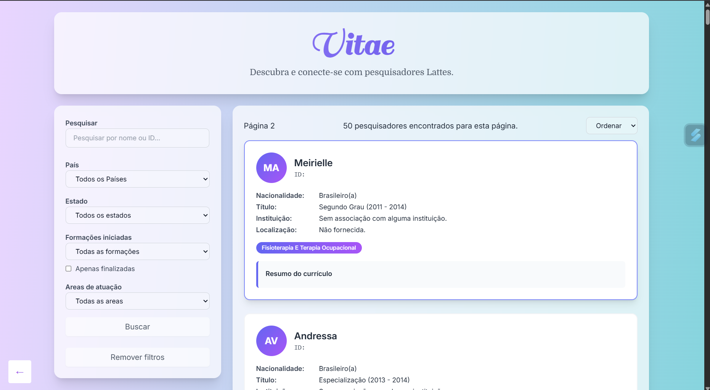

<h1 align="center">Vitae</h1>



<p align="center">Vitae's Web UI showcase</p>

## Requirements

- [Python 3.12](https://www.python.org/)
- [PostgreSQL 17](https://www.postgresql.org/)
- [Python Poetry](https://python-poetry.org/)

## How to run it

### 1. Dependencies

```
poetry install
```

### 2. Environment Settings


```bash
cp vitae.example.toml vitae.toml
# Now edit it to use your own settings
```

### 3. Virtual Environment

```bash
poetry env activate
```

On *Visual Studio Code*: <kbd>Ctrl</kbd> + <kbd>Shift</kbd> + <kbd>P</kbd>,
then search for: *"Python: Select Interpreter"* and choose the one from Poetry's isolated environment.

### 4. Bootstrap

Before running the application for the first time, complete these steps:

1. **Create the Database**

Ensure your PostgreSQL database exists, using the same settings you specified in [Environment Settings](#2-environment-settings):

```bash
createdb <your-database> -U <your-user>
```

2. **Add Your Curricula Repository**

Place your curricula repository in the root directory of this project (at the same level as the source code).

> [!WARNING]
> Add your curricula repository to `.gitignore` to avoid accidentally uploading it to remote.

3. **Directory Structure**

Your curricula's directory should look like this:

```text
root
|-- <curricula>   # Your curricula repository
|    |-- 00
|    |-- 01
|    |-- 02
|    +-- ...
|
|-- logs
|-- scripts
|-- tests
|-- vitae
|-- ...
```


### 5. Execute

```bash
vitae
```

Remember to install with `poetry install` before run as a script.
Otherwise, you may run as `python -m vitae`.

> If you want to execute the web application from uvicorn for some reason, try: `poetry run uvicorn vitae.__main__:web_new --factory --reload `.

### 6. Explore

To know more about each detail of this project, just open `vitae` and read the documentation for each feature, which includes the objective and architectural decisions for each one.
The source code also provides documentation for crucial sections.

## Tooling Recomentation

1. **DBA tools**
  - [Beekeeper Studio](https://www.beekeeperstudio.io/) for SQL Queries. (Community ed. for Free)
  - [ChartDB](https://github.com/chartdb/chartdb) for Diagram visualization. (Self-hosted for free)
  - **pgAdmin 4**, general purpose. Comes with PostgreSQL. (Free)
2. **Python Linters, Formatters, Static Analysis**
  - [`ruff`](https://docs.astral.sh/ruff/) linter and code formatter. (lightweight alternative)
  - [`ty`](https://github.com/astral-sh/ty) Python type checking. (lightweight alternative)
  - [Pylance](https://marketplace.visualstudio.com/items?itemName=ms-python.vscode-pylance) VsCode's Extension
    as language server.